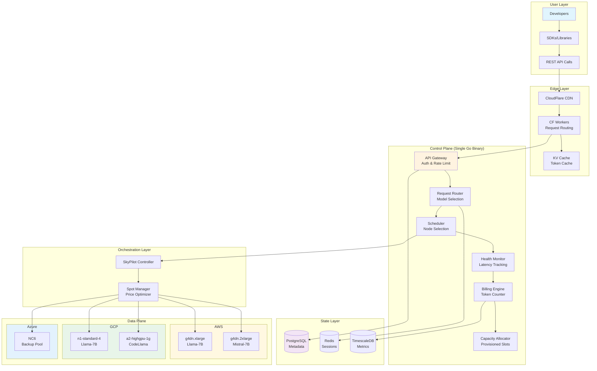

# **CrossLogic Inference Cloud (CIC)**
## **Complete Product Documentation Suite**

# **Document 1: Product Requirements Document (PRD)**
## **Version 2.0 - Production Ready**

### **1. Executive Summary**

**Mission**: Democratize LLM inference by making it 10x cheaper through multi-cloud spot arbitrage, starting with India's underserved market.

**Vision**: Become the "Vercel for LLMs" - instant deployment, global scale, zero complexity.

**Solo Developer Strategy**: Build narrow but deep. One region, two models, perfect execution beats ten regions with bugs.

CrossLogic.AI is a multi-region, spot-GPU–powered inference platform built for hosting open-source generative AI models (Llama, Mistral, Qwen, Gemma, etc.) at extremely low cost with enterprise-grade multi-tenancy, OpenAI-compatible APIs, and on-prem deployment options.

The platform targets two key customer groups:

1. Developers & Startups
	•	Need cheap, fast inference endpoints
	•	Want OpenAI-compatible API
	•	Prefer India/region-local hosting
	•	Want predictable billing and API keys

2. Enterprise Fortune 500
	•	Need air-gapped GPU inference
	•	Want a cloud-managed Control Plane
	•	Require isolation, audit, and SSO
	•	Prefer open-source models for IP safety

The final state is a global inference mesh orchestrated via SkyPilot + custom Control Plane (Go), delivering serverless, reserved capacity, and region-pinned inference.

### **2. Product Principles**

```yaml
Core Principles:
  1. "Default to Simple": Every feature starts minimal
  2. "Revenue First": Ship features that directly drive MRR
  3. "Automate or Die": If you do it twice, automate it
  4. "Measure Everything": Data drives decisions
  5. "Customer Success > Features": 10 happy customers > 100 features
```

✔ Make inference cheap

Use spare/spot GPUs from AWS/GCP/Azure/OCI/E2E/Yotta.

✔ Provide predictable performance

Reserved capacity via token-per-second guarantees.

✔ Deliver multi-region low-latency LLM access

User selects:
🇮🇳 India, 🇺🇸 USA, 🇪🇺 Europe, 🇸🇬 APAC, etc.

✔ Provide OpenAI-compatible APIs

/v1/chat/completions, /v1/embeddings, etc.

✔ Provide a simple developer dashboard
	•	Create org
	•	Create env (dev/test/prod)
	•	Generate API keys
	•	Choose region
	•	Choose model
	•	View usage/billing

✔ Provide an enterprise on-prem edition
	•	Local GPU node agent
	•	Cloud-hosted Control Plane
	•	Or fully air-gapped mode


### **3. Market Positioning**

```markdown
## Target Segments (Priority Order)

### Segment 1: Indian Startups (Immediate)
- Size: 5,000 companies
- Budget: $100-1,000/month
- Pain: OpenAI too expensive, unreliable in India
- Solution: 80% cheaper, Mumbai hosting, INR billing

### Segment 2: Global Indie Developers (Month 3)
- Size: 50,000 developers
- Budget: $10-500/month
- Pain: Unpredictable AI costs
- Solution: Capped spend, predictable pricing

### Segment 3: Enterprises (Month 12)
- Size: 500 companies
- Budget: $10K-100K/month
- Pain: Compliance, data residency
- Solution: On-prem deployment, SOC2
```

#### Key Features

1. OpenAI-Compatible Inference API
	•	Chat completions
	•	Completions
	•	Embeddings
	•	Streaming

2. Multi-Region Model Hosting
	•	User chooses country/city
	•	Endpoint tied to region
	•	Control Plane handles routing

3. Multi-Environment Support

Each org gets:
	•	dev
	•	staging
	•	prod

Each environment has:
	•	its own API keys
	•	its own quotas
	•	its own region
	•	its own usage

4. Multi-Tenancy Isolation
	•	Per-tenant rate limits
	•	Per-key API quotas
	•	Region-based capacity reservation
	•	Token bucketing enforcement

5. Model Catalog (Open-Source Only)

Supported families:
	•	Llama
	•	Mistral
	•	Qwen
	•	Gemma
	•	Phi
	•	Yi
	•	Embedding models

6. Two Pricing Modes
	1.	Serverless (pay per token)
	2.	Reserved Capacity (CUs = tokens/sec guaranteed)

7. Billing
	•	Stripe metered billing
	•	Per-region pricing
	•	Free tier
	•	Overuse protection

8. On-Prem Hybrid Mode
	•	GPU nodes inside enterprise DC
	•	Managed control plane
	•	Secure gRPC tunnel
	•	Local inference, cloud billing


### **4. Product Architecture**

```yaml
MVP Architecture (First 100 Customers):
  
  Frontend:
    - Next.js dashboard (use Vercel template)
    - Stripe Checkout (no custom billing UI)
    - Simple usage graphs (Recharts)
  
  Control Plane:
    - Single Go binary (all-in-one)
    - PostgreSQL (Supabase free tier)
    - Redis (Upstash serverless)
  
  Data Plane:
    - SkyPilot on 3 providers
    - vLLM for inference
    - 2 models initially
  
  Networking:
    - CloudFlare Tunnel (no VPN complexity)
    - Direct HTTPS between nodes
```

#### Architecture Principles
	1.	Distributed inference nodes (vLLM/SGLang)
	2.	SkyPilot as compute orchestrator
	3.	Tailscale as mesh network  ## TO-DO add or remove tailscale 
	4.	Go-based control plane
	5.	Redis for counters & rate limiting
	6.	Postgres for org/env/model metadata
	7.	LiteLLM only as request parser/adapter
	8.	Stripe usage-based billing

### **5. Components**

1. Dashboard

Next.js + Shadcn
	•	Manage org
	•	Create environments
	•	View usage
	•	Select region
	•	Select model
	•	Get endpoint URL

2. API Gateway (LiteLLM wrapped by Go)
	•	Parses OpenAI payload
	•	Validates key
	•	Applies rate limits
	•	Sends to control plane router

3. Control Plane (Go)

Handles:
	•	Node registry
	•	Scheduler
	•	Rate limiter
	•	Token accounting
	•	Region router
	•	Load shedding
	•	Billing reporting
	•	Node drain + spot eviction recovery

4. Data Plane (vLLM/SGLang Nodes)

Each GPU node:
	•	Starts via SkyPilot
	•	Joins Tailscale
	•	Registers with control plane
	•	Runs inference RPC server
	•	Reports metrics

### **6. User Flows**

1. User Signup
	•	Sign in via Google or Microsoft
	•	Creates ORG row
	•	Admin gets access to dashboard

2. User Creates Environment
	•	Choose region (India/US/EU/SG)
	•	Choose models to enable
	•	Create API keys

3. User Calls API

POST https://inference.crosslogic.ai/{org}/{env}/{model}/v1/chat/completions

4. Control Plane Routing Flow
	1.	Validate key
	2.	Validate quota
	3.	Determine region
	4.	Pick GPU node
	5.	Forward request
	6.	Track tokens
	7.	Billing event recorded
	8.	Response streamed


### **7. Feature Roadmap**

####  System Requirements

Performance
	•	p50 under 80 ms India
	•	p99 under 150 ms
	•	1000 RPS per region (initial)

Reliability
	•	Auto recovery from spot eviction
	•	Graceful draining
	•	Node health checks
	•	Billing accuracy: 99.999%

Scalability
	•	New regions added without downtime
	•	Distributed control plane support
	•	API Gateway horizontally scalable

#### **Phase 1: MVP (Week 1-4)**
```markdown
Must Have:
☐ API key generation
☐ OpenAI-compatible endpoint
☐ Llama-7B and Mistral-7B
☐ Basic usage tracking
☐ Stripe payment

Nice to Have:
☐ Streaming responses
☐ Usage dashboard
☐ Model switching
```

#### **Phase 2: Growth (Month 2-3)**
```markdown
Features:
☐ 5 more models
☐ Provisioned capacity
☐ Team accounts
☐ Webhook notifications
☐ Python/JS SDKs
```

#### **Phase 3: Scale (Month 4-6)**
```markdown
Features:
☐ Global regions
☐ Fine-tuning API
☐ Enterprise SSO
☐ SLA guarantees
☐ On-prem package
```
####  Out-of-Scope
	•	Model fine-tuning
	•	Private model uploads
	•	GPU burst parallelism across nodes
	•	On-prem billing engine (v1)

### **7. Success Metrics**

```yaml
Week 1 Goals:
  - 1 working endpoint
  - 1 paying customer
  - <200ms latency

Month 1 Goals:
  - 10 customers
  - $1,000 MRR
  - 99% uptime

Month 3 Goals:
  - 100 customers
  - $10,000 MRR
  - 3 regions

Month 6 Goals:
  - 500 customers
  - $50,000 MRR
  - Break-even
```

---

# **Document 2: System Architecture Diagram**



# **High level system diagram**

```
                    ┌───────────────────────────────────┐
                    │        Developer Dashboard         │
                    │  (Next.js + Shadcn + Supabase)    │
                    └───────────────┬───────────────────┘
                                    │
                                    ▼
                        ┌──────────────────────┐
                        │      API Gateway     │
                        │ (LiteLLM + Go Wrapper│
                        └──────────────┬──────┘
                                       │
                           Validate Key│
                           Enforce Quota│
                                       ▼
                         ┌─────────────────────┐
                         │    Control Plane    │
                         │   (Go + Redis + PG) │
                         ├─────────────────────┤
                         │ Region Router       │
                         │ Token Accountant    │
                         │ Scheduler           │
                         │ Node Registry       │
                         │ Billing Reporter    │
                         └──────────┬──────────┘
                                    │
               ┌────────────────────┼────────────────────┐
               │                    │                    │
               ▼                    ▼                    ▼
       ┌──────────────┐    ┌──────────────┐    ┌──────────────────┐
       │ Region: India │    │ Region: EU   │    │ Region: USA       │
       │  Node Pool    │    │  Node Pool   │    │  Node Pool        │
       └──────┬────────┘    └──────┬───────┘    └─────────┬────────┘
              │                     │                        │
              ▼                     ▼                        ▼
   ┌─────────────────┐   ┌─────────────────┐     ┌─────────────────┐
   │  vLLM / SGLang   │   │ vLLM / SGLang    │     │ vLLM / SGLang    │
   │   GPU Worker     │   │   GPU Worker     │     │   GPU Worker     │
   └──────────────────┘   └──────────────────┘     └──────────────────┘
```


# **Document 3: Control Plane Architecture Document**
## **Go-Based Implementation for Solo Developer**

### **Section 1: Overview**

The control plane is a single Go binary that handles all orchestration, routing, and management tasks. Designed for solo operation with gradual modularization.

### **Section 2: Core Philosophy**

```yaml
Design Principles:
  - Single binary deployment (no microservices initially)
  - SQLite for development, PostgreSQL for production
  - Graceful degradation over complex failover
  - Observability built-in from day one
```

### **Section 3: Directory Structure**

```bash
control-plane/
├── cmd/
│   └── server/          # Main entry point
├── internal/
│   ├── gateway/         # API gateway
│   ├── router/          # Request routing
│   ├── scheduler/       # Node scheduling
│   ├── allocator/       # Capacity management
│   ├── billing/         # Usage tracking
│   ├── monitor/         # Health checks
│   └── orchestrator/    # SkyPilot wrapper
├── pkg/
│   ├── models/          # Data models
│   ├── database/        # DB abstraction
│   ├── cache/           # Redis client
│   └── telemetry/       # Metrics/logging

```

### **Section 4: Gateway Module**

```go
// internal/gateway/gateway.go
type Gateway struct {
    authenticator *Authenticator
    rateLimiter   *RateLimiter
    validator     *RequestValidator
    
    // Middleware chain
    middlewares []Middleware
}

// Key responsibilities:
// - API key validation
// - Rate limiting (token bucket)
// - Request validation
// - Audit logging
// - CORS handling
```

### **Section 5: Authentication System**

```go
// internal/gateway/auth.go
type Authenticator struct {
    keyStore KeyStore
    cache    *redis.Client
}

// API Key Format: sk_[env]_[random]
// Example: sk_live_a4f5b2c8d9e0f1g2

type APIKey struct {
    Key         string
    TenantID    string
    Environment string // dev/staging/prod
    RateLimit   int
    CreatedAt   time.Time
    LastUsed    time.Time
}
```

### **Section 6: Request Router**

```go
// internal/router/router.go
type Router struct {
    modelRegistry *ModelRegistry
    loadBalancer  *LoadBalancer
    fallback      *FallbackHandler
}

// Routing decision factors:
// 1. Model availability
// 2. Geographic proximity
// 3. Current node load
// 4. Spot price
// 5. Tenant preferences
```

### **Section 7: Intelligent Scheduler**

```go
// internal/scheduler/scheduler.go
type Scheduler struct {
    nodePool     *NodePool
    strategy     SchedulingStrategy
    predictor    *LoadPredictor
}

type SchedulingStrategy interface {
    SelectNode(request *Request, nodes []*Node) *Node
}

// Strategies:
// - RoundRobin (simple start)
// - LeastConnections 
// - WeightedResponse (by latency)
// - CostOptimized (cheapest spot)
// - Predictive (ML-based)
```

### **Section 8: Capacity Allocator**

```go
// internal/allocator/allocator.go
type CapacityAllocator struct {
    reservations map[string]*Reservation
    tokenBuckets map[string]*TokenBucket
}

type Reservation struct {
    TenantID     string
    TokensPerSec int
    Model        string
    Priority     int
    ExpiresAt    time.Time
}

// Allocation algorithm:
// 1. Check if tenant has reservation
// 2. If yes, provide guaranteed slot
// 3. If no, add to shared queue
// 4. Preempt lower priority if needed
```

### **Section 9: Node Pool Management**

```go
// internal/scheduler/nodepool.go
type NodePool struct {
    nodes      sync.Map // thread-safe
    health     map[string]HealthStatus
    capacity   map[string]Capacity
}

type Node struct {
    ID           string
    Provider     string // aws/gcp/azure
    Region       string
    Model        string
    Endpoint     string
    SpotPrice    float64
    Healthy      bool
    TokensPerSec int
}
```

### **Section 10: Health Monitoring**

```go
// internal/monitor/health.go
type HealthMonitor struct {
    checkers  []HealthChecker
    alerts    *AlertManager
    metrics   *MetricsCollector
}

// Health checks:
// - Node liveness (ping)
// - Model readiness (inference test)
// - Latency monitoring (P50/P95/P99)
// - Token throughput
// - Error rate tracking
```

### **Section 11: Billing Engine Integration**

```go
// internal/billing/engine.go
type BillingEngine struct {
    meter    *TokenMeter
    pricer   *PricingCalculator
    stripe   *StripeClient
    reporter *UsageReporter
}

type Usage struct {
    TenantID     string
    Model        string
    InputTokens  int64
    OutputTokens int64
    CachedTokens int64
    Timestamp    time.Time
}
```

### **Section 12: SkyPilot Orchestration**

```go
// internal/orchestrator/skypilot.go
type SkyPilotOrchestrator struct {
    executor *CommandExecutor
    parser   *YAMLParser
    monitor  *JobMonitor
}

// Responsibilities:
// - Launch spot instances
// - Handle interruptions
// - Scale up/down
// - Cost optimization
```

### **Section 13: Database Schema**

```sql
-- Core tables for control plane

CREATE TABLE tenants (
    id UUID PRIMARY KEY,
    name VARCHAR(255),
    email VARCHAR(255),
    stripe_customer_id VARCHAR(255),
    created_at TIMESTAMP
);

CREATE TABLE api_keys (
    key VARCHAR(255) PRIMARY KEY,
    tenant_id UUID REFERENCES tenants(id),
    environment VARCHAR(50),
    rate_limit INTEGER,
    created_at TIMESTAMP,
    last_used_at TIMESTAMP
);

CREATE TABLE nodes (
    id UUID PRIMARY KEY,
    provider VARCHAR(50),
    region VARCHAR(50),
    instance_type VARCHAR(100),
    model VARCHAR(255),
    endpoint VARCHAR(500),
    spot_price DECIMAL(10,4),
    status VARCHAR(50),
    created_at TIMESTAMP
);

CREATE TABLE usage_records (
    id UUID PRIMARY KEY,
    tenant_id UUID,
    model VARCHAR(255),
    input_tokens INTEGER,
    output_tokens INTEGER,
    latency_ms INTEGER,
    timestamp TIMESTAMP
);
```

### **Section 14: Cache Strategy**

```go
// internal/cache/strategy.go
type CacheStrategy struct {
    redis     *redis.Client
    ttl       time.Duration
    keyPrefix string
}

// Cache layers:
// 1. API key validation (5 min)
// 2. Model endpoints (30 sec)
// 3. Node health (10 sec)
// 4. Tenant quotas (1 min)
// 5. Common responses (5 min)
```

### **Section 15: Error Handling**

```go
// internal/errors/errors.go
type ErrorHandler struct {
    fallback *FallbackService
    retry    *RetryPolicy
    circuit  *CircuitBreaker
}

// Error categories:
// - Transient (retry with backoff)
// - Permanent (fail fast)
// - Quota (return 429)
// - Auth (return 401)
// - Server (return 503 + fallback)
```

### **Section 16: Request Pipeline**

```yaml
Request Flow:
  1. CloudFlare Edge → 
  2. API Gateway (auth) →
  3. Rate Limiter →
  4. Request Router →
  5. Queue (if needed) →
  6. Scheduler →
  7. Node Selection →
  8. Inference Request →
  9. Response Stream →
  10. Billing Meter →
  11. Response Cache →
  12. Client
```

### **Section 17: Configuration Management**

```go
// internal/config/config.go
type Config struct {
    Server   ServerConfig
    Database DatabaseConfig
    Redis    RedisConfig
    Billing  BillingConfig
    Models   []ModelConfig
    Providers []ProviderConfig
}

// Load from environment + file
// Hot reload without restart
// Feature flags for gradual rollout
```

### **Section 18: Observability Stack**

```go
// internal/telemetry/telemetry.go
type Telemetry struct {
    metrics *prometheus.Registry
    tracer  trace.Tracer
    logger  *zap.Logger
}

// Key metrics:
// - inference_requests_total
// - inference_duration_seconds
// - tokens_processed_total
// - spot_price_dollars
// - node_health_score
```

### **Section 19: Admin Interface**

```go
// internal/admin/admin.go
type AdminServer struct {
    dashboard *Dashboard
    api       *AdminAPI
    auth      *AdminAuth
}

// Embedded UI features:
// - Real-time metrics
// - Node management
// - Customer list
// - Usage graphs
// - Alert configuration
```

### **Section 20: Deployment Strategy**

```bash
# Single binary deployment
go build -o cic-control cmd/server/main.go

# Systemd service
[Unit]
Description=CIC Control Plane
After=network.target

[Service]
Type=simple
User=cic
ExecStart=/usr/local/bin/cic-control
Restart=on-failure
Environment="DATABASE_URL=postgresql://..."

[Install]
WantedBy=multi-user.target
```

### **Section 21: Security Measures**

```go
// internal/security/security.go
type SecurityManager struct {
    encryption *Encryption
    audit      *AuditLogger
    scanner    *VulnScanner
    firewall   *IPFirewall
}

// Security features:
// - API key rotation
// - Request signing
// - IP allowlisting
// - DDoS protection
// - SQL injection prevention
```

### **Section 22: Spot Price Optimizer**

```go
// internal/orchestrator/optimizer.go
type SpotPriceOptimizer struct {
    providers map[string]Provider
    history   *PriceHistory
    predictor *PricePredictor
}

// Algorithm:
// 1. Query spot prices every 5 min
// 2. Predict price trends
// 3. Pre-launch if price dropping
// 4. Migrate if price spiking
```

### **Section 23: Migration System**

```go
// internal/migration/migration.go
type MigrationManager struct {
    source    *Node
    target    *Node
    strategy  MigrationStrategy
}

// Migration triggers:
// - Spot interruption warning
// - Price spike (>2x)
// - Health degradation
// - Manual trigger
```

### **Section 24: Queue Management**

```go
// internal/queue/queue.go
type RequestQueue struct {
    priority *PriorityQueue
    overflow *DiskQueue
    timeout  time.Duration
}

// Queue strategies:
// - FIFO for free tier
// - Priority for paid
// - Preemptive for enterprise
```

### **Section 25: Load Testing**

```go
// internal/testing/load.go
type LoadTester struct {
    generator *RequestGenerator
    recorder  *MetricsRecorder
    analyzer  *ResultAnalyzer
}

// Automated tests:
// - Sustained load (100 req/s)
// - Burst traffic (1000 req/s)
// - Failure scenarios
// - Spot interruptions
```

### **Section 26: Backup & Recovery**

```yaml
Backup Strategy:
  Database:
    - PostgreSQL WAL streaming
    - Daily snapshots to S3
    - Point-in-time recovery
    
  Configuration:
    - Git versioned configs
    - Encrypted secrets in Vault
    
  State:
    - Redis persistence (AOF)
    - Regular dumps to S3
```

### **Section 27: Gradual Rollout**

```go
// internal/features/flags.go
type FeatureFlags struct {
    store     FlagStore
    evaluator *FlagEvaluator
}

// Feature flags for:
// - New models
// - Pricing changes
// - Algorithm updates
// - Region expansion
```

### **Section 28: Customer Onboarding**

```go
// internal/onboarding/onboarding.go
type OnboardingFlow struct {
    steps    []OnboardingStep
    tracker  *ProgressTracker
    notifier *EmailNotifier
}

// Automated onboarding:
// 1. Email verification
// 2. API key generation
// 3. $10 free credits
// 4. Sample code email
// 5. First request tracking
```

### **Section 29: Compliance & Audit**

```go
// internal/compliance/compliance.go
type ComplianceManager struct {
    auditor  *AuditLogger
    reporter *ComplianceReporter
    scanner  *DataScanner
}

// Compliance tracking:
// - API access logs
// - Data residency
// - Token usage audit
// - PII detection
// - GDPR compliance
```

### **Section 30: Performance Optimization**

```go
// internal/performance/optimizer.go
type PerformanceOptimizer struct {
    profiler  *CPUProfiler
    analyzer  *MemoryAnalyzer
    optimizer *QueryOptimizer
}

// Optimization targets:
// - Sub-10ms API gateway
// - <100ms routing decision
// - 10K concurrent connections
// - <1% memory growth/day
```

---

# **Document 4: Billing Engine Specification**

## **1. Overview**

Token-based metering with dual pricing models: pay-as-you-go and provisioned capacity.

## **2. Core Components**

```go
// billing/core.go
type BillingCore struct {
    meter     *TokenMeter
    calculator *PriceCalculator
    aggregator *UsageAggregator
    reporter   *StripeReporter
    alerts     *BillingAlerts
}
```

## **3. Token Metering**

```go
// billing/meter.go
type TokenMeter struct {
    counter  *AtomicCounter
    buffer   *RingBuffer
    flusher  *BatchFlusher
}

type TokenCount struct {
    TenantID     string
    RequestID    string
    Model        string
    InputTokens  int32
    OutputTokens int32
    TotalTokens  int32
    Cached       bool
    Timestamp    int64
}

// Counting strategy:
// 1. Count at inference time
// 2. Buffer in memory (1000 records)
// 3. Flush to DB every 10 seconds
// 4. Aggregate hourly for billing
```

## **4. Pricing Models**

```go
// billing/pricing.go
type PricingModel struct {
    Base        BasePricing
    Volume      VolumeDiscounts
    Commitment  CommitmentPricing
    Regional    RegionalPricing
}

type BasePricing struct {
    PayAsYouGo   float64 // $0.50 per 1M tokens
    Provisioned  float64 // $100 per 100 tokens/sec/month
}

type VolumeDiscounts []struct {
    Threshold int64   // Token count
    Discount  float64 // Percentage
}

// Example tiers:
// 0-10M tokens: 0% discount
// 10M-100M: 10% discount
// 100M-1B: 20% discount
// 1B+: 30% discount
```

## **5. Usage Aggregation**

```sql
-- Hourly aggregation query
INSERT INTO usage_hourly (
    tenant_id,
    hour,
    model,
    total_tokens,
    total_requests,
    avg_latency,
    cost
)
SELECT 
    tenant_id,
    date_trunc('hour', timestamp) as hour,
    model,
    SUM(total_tokens) as total_tokens,
    COUNT(*) as total_requests,
    AVG(latency_ms) as avg_latency,
    SUM(total_tokens) * 0.0000005 as cost
FROM usage_records
WHERE timestamp >= NOW() - INTERVAL '1 hour'
GROUP BY tenant_id, hour, model;
```

## **6. Stripe Integration**

```go
// billing/stripe.go
type StripeIntegration struct {
    client   *stripe.Client
    webhook  *WebhookHandler
    invoicer *InvoiceGenerator
}

// Usage reporting flow:
// 1. Daily aggregation at midnight UTC
// 2. Create usage record in Stripe
// 3. Stripe generates invoice
// 4. Webhook updates our DB
// 5. Email customer
```

## **7. Free Tier & Credits**

```go
// billing/credits.go
type CreditManager struct {
    balance map[string]int64 // cents
    rules   *CreditRules
}

type CreditRules struct {
    SignupBonus    int64 // $10 free
    ReferralBonus  int64 // $5 per referral
    MonthlyFree    int64 // 100K tokens free
}

// Credit application order:
// 1. Free monthly allowance
// 2. Promotional credits
// 3. Paid credits
// 4. Pay-as-you-go
```

## **8. Invoice Generation**

```go
// billing/invoice.go
type InvoiceGenerator struct {
    template *InvoiceTemplate
    pdf      *PDFGenerator
    storage  *S3Storage
}

// Invoice contains:
// - Usage breakdown by model
// - Hourly usage graph
// - Credit applied
// - Next billing date
// - Payment method
```

## **9. Alert System**

```go
// billing/alerts.go
type BillingAlerts struct {
    thresholds map[string]Threshold
    notifier   *MultiChannelNotifier
}

// Alert triggers:
// - 80% of monthly budget
// - Unusual spike (>10x daily average)
// - Payment failure
// - Credit expiring
// - Provisioned capacity exceeded
```

## **10. Reporting Dashboard**

```yaml
Dashboard Metrics:
  Real-time:
    - Current spend today
    - Tokens used (last hour)
    - Active models
    - Request count
    
  Historical:
    - Daily spend (30 days)
    - Token usage by model
    - Cost per request
    - Savings vs OpenAI
    
  Projections:
    - Monthly estimate
    - Optimization suggestions
    - Commitment recommendations
```

---

# **Document 5: Additional Critical Documents**

## **A. Operational Runbook**

### **Daily Operations Checklist**

```bash
# Morning (9 AM)
□ Check overnight alerts
□ Review spot price changes
□ Verify all models responsive
□ Check payment failures
□ Review new signups

# Afternoon (2 PM)
□ Monitor usage spikes
□ Check node health scores
□ Review error rates
□ Update status page

# Evening (6 PM)
□ Run backup verification
□ Check capacity for next day
□ Review customer tickets
□ Update metrics dashboard
```

### **Incident Response Plan**

```yaml
Severity Levels:
  P0: Complete outage
    Response: Immediate
    Escalation: Page founder
    
  P1: Degraded service
    Response: 30 minutes
    Escalation: Slack alert
    
  P2: Single node failure
    Response: 2 hours
    Escalation: Email
    
  P3: Non-critical issue
    Response: Next business day
    Escalation: Ticket
```

## **B. Go-to-Market Execution Plan**

### **Week 1: Foundation**
```markdown
Day 1-2: Setup
- [ ] Register domain
- [ ] Stripe account
- [ ] CloudFlare setup
- [ ] GitHub repos

Day 3-4: Core Build
- [ ] Control plane skeleton
- [ ] Basic API endpoint
- [ ] PostgreSQL setup

Day 5-7: First Model
- [ ] Deploy Llama-7B
- [ ] Test endpoint
- [ ] Basic monitoring
```

### **Week 2-4: MVP**
```markdown
- [ ] API key generation
- [ ] Usage tracking
- [ ] Payment integration
- [ ] Documentation site
- [ ] 3 beta customers
```

## **C. Customer Acquisition Strategy**

### **First 10 Customers**
```yaml
Channels:
  1. Personal Network:
     - LinkedIn posts
     - WhatsApp groups
     - Ex-colleagues
     
  2. Communities:
     - r/LocalLLaMA
     - HackerNews Show
     - Dev.to article
     
  3. Direct Outreach:
     - 50 cold emails
     - Focus: AI startups
     - Offer: $100 credits
```

### **Pricing Strategy**
```yaml
Launch Pricing:
  Starter:
    - $0/month
    - 100K tokens free
    - Community support
    
  Developer:
    - $49/month
    - 10M tokens included
    - Email support
    - 99% SLA
    
  Business:
    - $499/month
    - 100M tokens included
    - Slack support
    - 99.9% SLA
    - Provisioned capacity
```

## **D. Technical Debt Management**

### **Acceptable Debt (First 100 Customers)**
```yaml
OK to Skip:
  - Microservices architecture
  - Kubernetes orchestration
  - Custom billing UI
  - Multi-region failover
  - Advanced caching
  
Must Have:
  - Basic monitoring
  - Payment processing
  - API stability
  - Documentation
  - Customer support
```

### **Refactoring Timeline**
```yaml
Month 1-3: Monolith is fine
Month 4-6: Extract billing service
Month 7-9: Separate data plane
Month 10-12: Full microservices
```

## **E. Emergency Playbooks**

### **Spot Instance Interruption**
```bash
#!/bin/bash
# Auto-triggered on spot termination notice

# 1. Mark node as draining
curl -X POST localhost:8080/nodes/$NODE_ID/drain

# 2. Stop accepting new requests
iptables -A INPUT -p tcp --dport 8000 -j REJECT

# 3. Wait for in-flight requests
sleep 20

# 4. Trigger replacement
curl -X POST localhost:8080/nodes/launch

# 5. Shutdown gracefully
systemctl stop vllm
```

### **Payment Provider Outage**
```yaml
Fallback Plan:
  1. Queue all usage data locally
  2. Enable manual invoicing
  3. Send email to customers
  4. Offer extended free credits
  5. Process backlog when restored
```

## **F. Documentation Templates**

### **API Documentation Structure**
```markdown
# CrossLogic Inference API

## Authentication
All requests require an API key...

## Endpoints
### POST /v1/completions
### POST /v1/chat/completions
### GET /v1/models

## SDKs
- Python: pip install crosslogic
- Node: npm install @crosslogic/inference
- Go: go get github.com/crosslogic/go-client

## Examples
[Simple completion]
[Streaming response]
[Error handling]

## Rate Limits
[Tier-based limits]

## Status Page
https://status.crosslogic.ai
```

---

## **Final Recommendations**

### **What to Build First (Week 1)**
1. Single Go binary with embedded SQLite
2. One spot instance with Llama-7B
3. Basic API endpoint (no auth)
4. Simple usage counter
5. Manual billing (send invoices)

### **What to Automate (Week 2-4)**
1. Spot instance launch/terminate
2. API key generation
3. Usage tracking to database
4. Health checks
5. Customer onboarding email

### **What to Buy/Use (Don't Build)**
1. Stripe for payments
2. SendGrid for emails
3. CloudFlare for CDN
4. Grafana Cloud for monitoring
5. GitHub Actions for CI/CD

### **Success Formula**
```
Success = (Great Latency × Reliable Service × Fair Price) / Complexity

Keep complexity minimal until 100 customers.
Then hire and rebuild for scale.
```

This comprehensive documentation gives you everything needed to build and launch your inference platform as a solo developer. Focus on execution over perfection - ship weekly, iterate based on customer feedback!