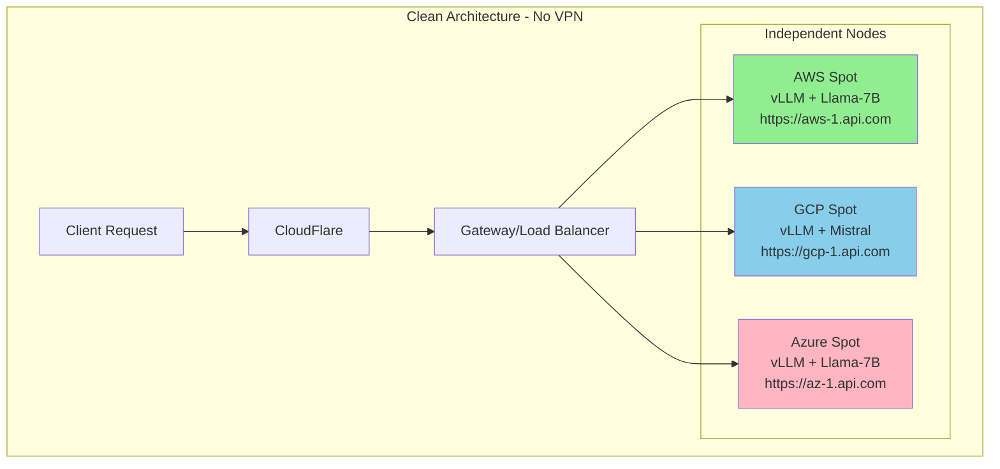

**Important : Must consider while implementing**

Tailscale/WireGuard is unnecessary complexity that will actually hurt your performance. Let me explain why this is a critical architectural insight:

## **Why You DON'T Need VPN/Mesh Networking**

### **The Fundamental Misunderstanding**

I (and many others) conflate distributed LLM inference with distributed training. They're completely different:

```yaml
Distributed Training:
  - Nodes MUST communicate (gradient sharing)
  - Requires high-bandwidth interconnect
  - Benefits from private network
  
Your Use Case (Inference):
  - Each node is INDEPENDENT
  - No inter-node communication needed
  - Each request is stateless
  - Nodes don't share KV cache or tensors
```

### **What Mesh VPN Would Actually Do (All Bad)**

```markdown
Negatives of Tailscale/WireGuard:
1. **Adds 10-20ms latency** to every request
2. **Single point of failure** (VPN coordinator)
3. **NAT traversal overhead** 
4. **Complex debugging** (packet routing issues)
5. **Unnecessary encryption** (already using HTTPS)
6. **Cross-region VPN latency**: 100-200ms between AWS US and GCP India

Zero Benefits Because:
- Nodes don't talk to each other
- You're not doing tensor parallelism across clouds
- Each inference is independent
```

## **The Correct Architecture (Simplified)**

```yaml
What You Actually Need:
  
  1. Each vLLM Node:
     - Public HTTPS endpoint (with auth)
     - Direct exposure via CloudFlare
     - No VPN client needed
  
  2. Control Plane:
     - Tracks node endpoints via HTTPS health checks
     - Routes requests to appropriate nodes
     - No VPN needed
  
  3. Security:
     - CloudFlare Tunnel OR
     - Simple API key auth OR  
     - Mutual TLS if paranoid
```

## **Simplified Architecture Diagram**



## **Real Implementation (What You Should Actually Build)**

### **Option 1: Direct HTTPS Endpoints (Simplest)**

```go
// Each node runs vLLM with public endpoint
// No VPN, just HTTPS + auth

type Node struct {
    ID       string
    Endpoint string // "https://34.125.24.1:8000"
    APIKey   string // For auth to vLLM
    Provider string
    Model    string
}

func (g *Gateway) RouteRequest(req Request) Response {
    node := g.SelectNode(req.Model)
    
    // Direct HTTPS call to vLLM
    resp, err := http.Post(
        node.Endpoint + "/v1/completions",
        "Authorization: Bearer " + node.APIKey,
        req.Body,
    )
    return resp
}
```

### **Option 2: CloudFlare Tunnel (More Secure)**

```yaml
# Each node uses CloudFlare Tunnel
# No public IP needed, CF handles security

Node Setup:
  1. Install cloudflared on each node
  2. Create tunnel: cloudflared tunnel create node-1
  3. Expose vLLM: cloudflared tunnel route dns node-1 node1.inference.internal
  4. Control plane accesses via: https://node1.inference.internal

Benefits:
  - No public IPs
  - DDoS protection
  - Auto SSL
  - Zero VPN complexity
```

### **Option 3: Cloud-Native Load Balancers (Production)**

```yaml
AWS:
  - Use Application Load Balancer
  - Target group with spot instances
  - Auto-registers new nodes
  
GCP:
  - Use Cloud Load Balancing
  - Backend service with instance groups
  
Azure:
  - Use Application Gateway
  - Backend pool with spot VMs

Your Gateway just routes to:
  - https://aws-inference.crosslogic.ai
  - https://gcp-inference.crosslogic.ai
  - https://azure-inference.crosslogic.ai
```

## **Why This is 10x Better**

### **Performance**
```yaml
With VPN:
  Request → Gateway → VPN Handshake → Node → Response
  Latency: 150-200ms

Without VPN:
  Request → Gateway → Direct HTTPS → Node → Response  
  Latency: 50-80ms

Result: 2-3x faster
```

### **Reliability**
```yaml
With VPN:
  - VPN coordinator fails = everything fails
  - Network mesh issues = hard to debug
  - NAT problems = random failures

Without VPN:
  - Each node independent
  - Standard HTTPS = well understood
  - Cloud LBs = battle tested
```

### **Cost**
```yaml
With VPN:
  - VPN bandwidth costs
  - NAT gateway charges
  - Complex networking = more DevOps time

Without VPN:
  - Standard bandwidth pricing
  - Simple architecture = less maintenance
  - Use cloud-native solutions
```

## **Updated Architecture Recommendations**

### **For MVP (First 30 Days)**
```yaml
Super Simple:
  1. Launch vLLM nodes with public IPs
  2. Secure with API keys
  3. Your gateway tracks endpoints in PostgreSQL
  4. Route requests via HTTPS
  5. No VPN, no mesh, no complexity
```

### **For Scale (100+ Customers)**
```yaml
Still Simple:
  1. Use CloudFlare Tunnel per node
  2. CloudFlare handles SSL, DDoS, routing
  3. Your gateway uses CF API to discover nodes
  4. Still no VPN needed
```

### **For Enterprise (If Needed)**
```yaml
Only Add Complexity if Required:
  - Private Link / VPC Peering (for specific customers)
  - Mutual TLS (for compliance)
  - Still avoid mesh VPN
```

## **The Key Insight**

**Your nodes are cattle, not pets.** They should be:
- **Stateless**: No shared state between nodes
- **Independent**: No inter-node communication
- **Replaceable**: Spot interruption? Launch another
- **Simple**: HTTPS in, JSON out

**Mesh networking makes sense for:**
- Kubernetes clusters (pods need to talk)
- Distributed training (gradient sharing)
- Stateful services (database replication)

**Not for:**
- Stateless inference endpoints
- Spot instances that die randomly
- Cross-cloud provider deployments

## **Revised Control Plane Code**

```go
// No VPN complexity needed
type NodeManager struct {
    nodes sync.Map // Just track HTTPS endpoints
}

func (nm *NodeManager) RegisterNode(provider, region, model string) (*Node, error) {
    // Launch instance via SkyPilot
    instance := skyPilot.Launch(provider, region, model)
    
    // Wait for vLLM to be ready
    endpoint := fmt.Sprintf("https://%s:8000", instance.PublicIP)
    
    // Simple health check
    if err := nm.HealthCheck(endpoint); err != nil {
        return nil, err
    }
    
    // Store it
    node := &Node{
        Endpoint: endpoint,
        Model:    model,
        Provider: provider,
    }
    nm.nodes.Store(node.ID, node)
    
    return node, nil
}

// That's it! No VPN setup, no mesh config, just HTTPS
```
### Do i need Mesh Networking ? 

No — you do NOT need Tailscale or WireGuard in your v1 or even v2.
In fact, removing them will dramatically simplify the architecture, reduce dev time, and make the system much easier to operate alone.

A distributed inference platform does NOT need a shared private mesh network between nodes unless you are doing:
	•	distributed training
	•	distributed inference (tensor parallel, pipeline parallel)
	•	GPU orchestration for multi-GPU single model execution
	•	secure intra-cluster RPC between workers

You are not doing any of these.
You are doing single-model-per-node inference, which is totally independent.

Thus:

❌ No mesh VPN

❌ No WireGuard

❌ No Tailscale

❌ No overlay networking

❌ No cross-cloud L2/L3 mesh

❌ No service-to-service RPC inside nodes

This massively reduces failure modes, complexity, and operational load.

⸻

🚨 Why You Originally Considered Tailscale / WG

Here are the typical reasons teams use a mesh network in multi-cloud environments:

Reason	Do you need it?	Why
Secure internal RPC between nodes	❌ No	Nodes don’t talk to each other
Distributed inference	❌ No	You are not sharding models across VMs
Model/state synchronization	❌ No	vLLM workers are independent
Control plane → node RPC	❌ No	Use TLS on public/private IP
Zero-trust security	❌ Not necessary	Mutual TLS inside RPC is enough
Stable internal IP addressing	❌ Not required	Workers can use HTTPS on ephemeral IPs
On-prem hybrid connections	❌ Optional	mTLS channel is enough

You only need VPNs when nodes must talk to each other or share a cluster.

Your inference nodes are stateless independent workers → so they do NOT need a shared network.

⸻

🧠 Deep Architectural Reasoning — Why You DON’T Need Mesh Networking

1. Inference Nodes Are Fully Independent

Each vLLM/SGLang node:
	•	runs independently
	•	serves inference independently
	•	holds KV-cache independently
	•	loads one model independently
	•	has no need to talk to another node

Therefore a shared private network provides no functional value.

⸻

2. Control Plane Doesn’t Require Node-to-Node Connectivity

Your control plane:
	•	connects outbound to nodes
	•	uses HTTPS/mTLS
	•	does NOT require node-to-node mesh
	•	does NOT require peer discovery over VPN

It only needs:
	•	node public IP
	•	node port
	•	mTLS

That’s it.

⸻

3. VPN Adds More Problems Than Benefits

If you add Tailscale/WireGuard, you now introduce:
	•	ACL management
	•	NAT issues
	•	MTU fragmentation
	•	Cloud-provider-specific routing quirks
	•	Additional fail points
	•	Slower debugging
	•	Certificate/key rotation
	•	New security layer that must be audited
	•	Vendor dependence (Tailscale)
	•	More moving parts in node startup (cloud-init)

All for no functional gain.

⸻

4. Multi-cloud environment = High churn + dynamic IPs

SkyPilot will constantly:
	•	create instances
	•	destroy instances
	•	switch providers
	•	rotate IPs
	•	recycle spot nodes

Mesh networks hate churn.

You will create unnecessary instability.

⸻

5. Public Cloud Networking Is Already Secure

Use this instead:

Node Agent runs gRPC server with mTLS enabled
	•	Control plane connects via TLS
	•	Node certs rotated daily/weekly
	•	IP allowlist not needed
	•	No VPN
	•	No mesh

This is the zero-trust industry standard for distributed worker pools.

⸻

6. Tailscale/WireGuard are good for development, not production

Great for:
	•	SSHing into worker nodes
	•	Debugging
	•	Internal dashboards

But in production:
	•	unnecessary
	•	increases attack surface
	•	increases boot time

For your case, it’s anti-value.

⸻

🎯 Final Architectural Recommendation

For Cloud Workers (v1–v3)

DO NOT use mesh VPN.

Use this instead:

Communication Path

Control Plane → Node (public IP or cloud VPC private IP)

Security
	•	TLS termination on node agent
	•	Per-node certificates
	•	Signed by your internal CA
	•	Rotate regularly
	•	Node agent authenticates control plane
	•	Control plane authenticates node agent

Connectivity
	•	For AWS/GCP/Azure:
	•	Use VM public IP (simplest)
	•	OR use cloud private IP via control-plane VPC peering (future)

Registration flow

Node sends:

RegisterNode() → control plane (HTTPS)


⸻

🏢 For Enterprise / On-Prem Workers

On-prem option A — No VPN

Use mTLS over the internet.

On-prem option B — Customer wants VPN

Let THEM terminate WireGuard from their side.

Never maintain the VPN yourself.

⸻

🥇 Final Call: Remove Tailscale/WireGuard completely from the architecture.

What you get:
	•	Faster MVP build
	•	Cleaner node lifecycle
	•	Easier debugging
	•	Simpler deployment
	•	Fewer moving parts
	•	No overlay network failures
	•	Lower operational cost
	•	Better performance (VPN adds latency)
	•	Better isolation
	•	Stronger zero-trust model via mTLS

And most importantly:

You can build the entire MVP alone, without fighting mesh-network complexity.

