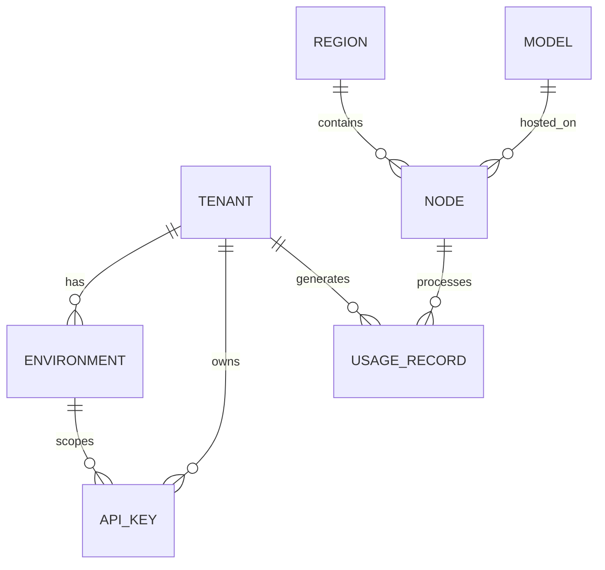

# Database Schema

The CrossLogic Inference Cloud uses PostgreSQL as its primary data store. The schema is designed for multi-tenancy, high throughput usage tracking, and efficient querying.

## Core Tables

### Tenants & Access Control

-   **`tenants`**: Represents an organization or user account.
    -   `id`: UUID (PK)
    -   `stripe_customer_id`: Link to Stripe.
    -   `billing_plan`: `serverless`, `reserved`, `enterprise`.
-   **`environments`**: Logical separation within a tenant (e.g., `dev`, `prod`).
    -   `quota_tokens_per_day`: Usage limits.
-   **`api_keys`**: Authentication tokens.
    -   `key_hash`: Hashed version of the key for storage.
    -   `rate_limit_*`: Granular rate limits.

### Infrastructure

-   **`regions`**: Geographic regions where inference is available.
    -   `cost_multiplier`: Regional pricing adjustments.
-   **`nodes`**: GPU workers available for inference.
    -   `provider`: AWS, GCP, Azure, On-prem.
    -   `health_score`: 0-100 metric of node reliability.
-   **`models`**: Catalog of supported LLMs.
    -   `price_*`: Pricing configuration.

### Usage & Billing

-   **`usage_records`**: Granular record of every inference request.
    -   `prompt_tokens`, `completion_tokens`: Usage metrics.
    -   `cost_microdollars`: Calculated cost.
-   **`usage_hourly`**: Aggregated usage for efficient reporting.
-   **`billing_events`**: Audit trail of billing actions (charges, credits).

### Operations

-   **`audit_logs`**: Security audit trail of administrative actions.
-   **`health_checks`**: History of node health pings.
-   **`webhook_events`**: Log of received webhooks for idempotency.

## Relationships

